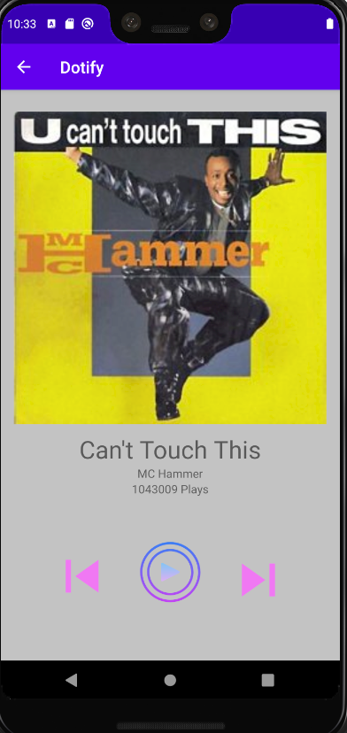

# Dotify
### Homework 3
### Matthew McVicker

##### This is a low functioning "music player" named Dotify that can alert users if they've skipped or went back on a track, change the number of plays, and change the username. I have added a songlist which can allow users to select songs and click to toolbar at the bottom to view the songplayer with their selected song. Added a new back button. Functionalities mostly the same, but use fragments and one activity. Also handles screen rotation.

##### EC Animate Shuffle

